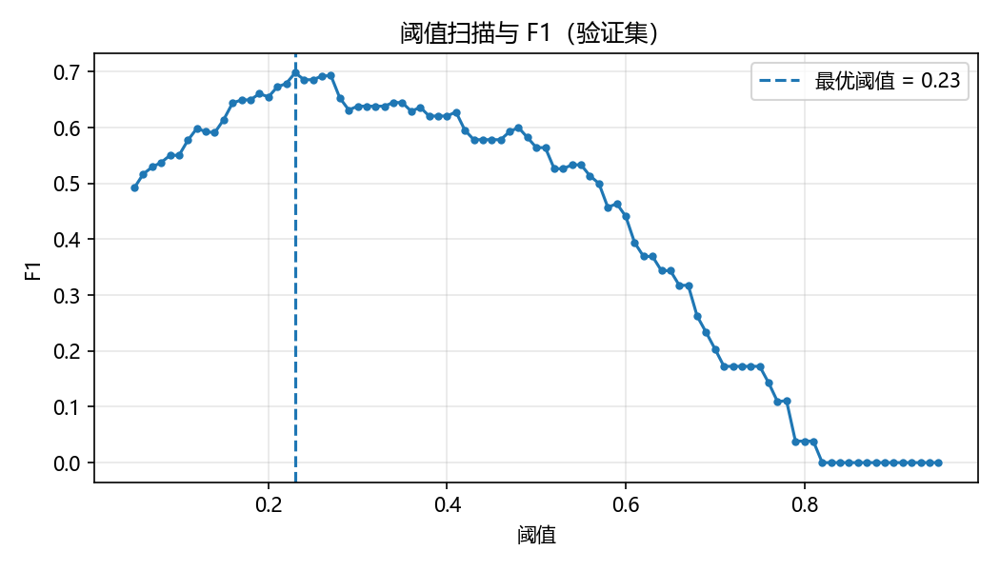
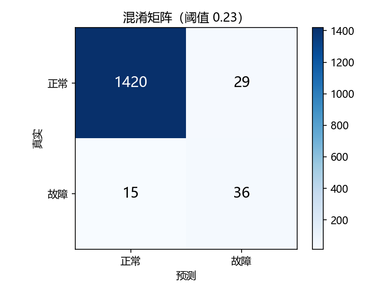
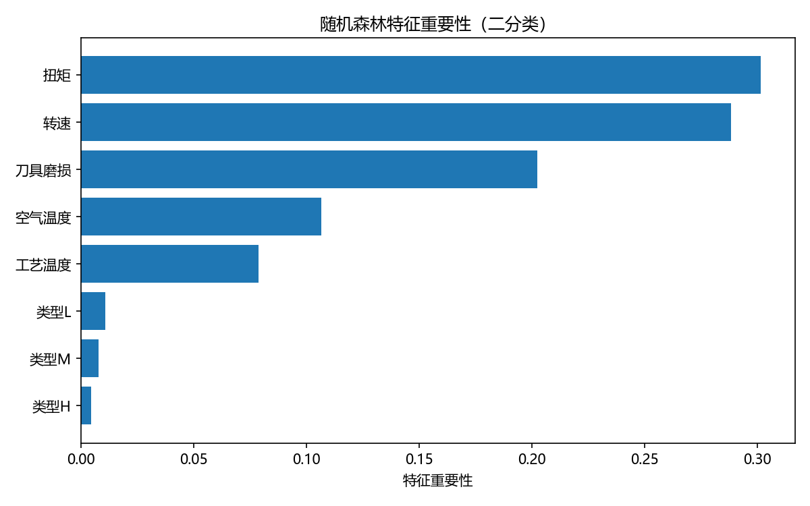
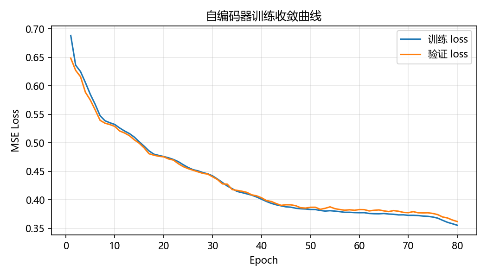
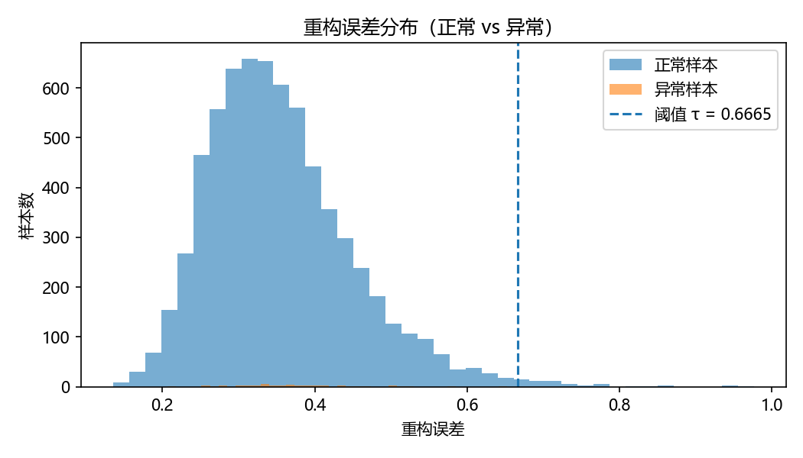
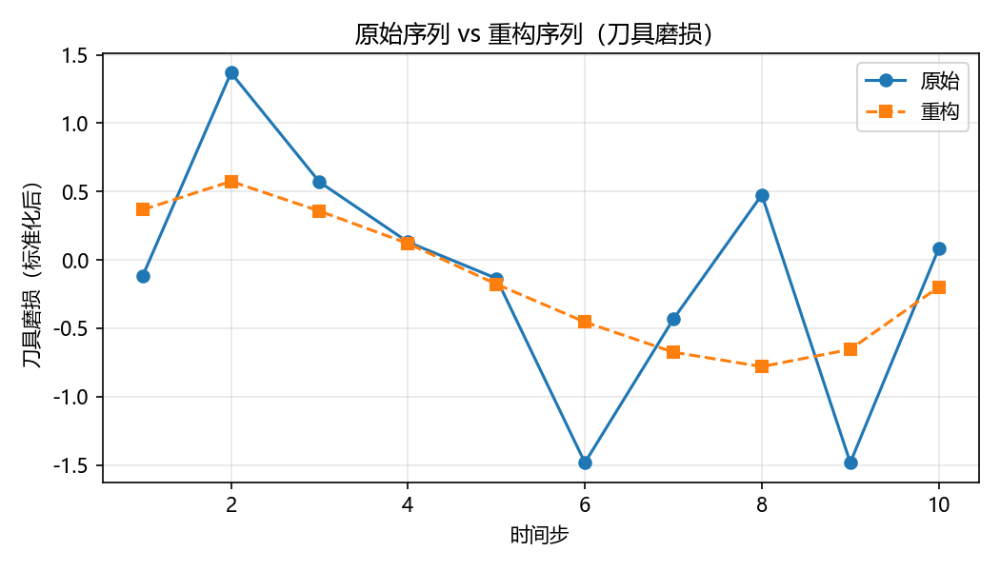

# 设备预测性维护智能应用

> —— 制造智能技术课程设计报告

**智造24-1　202412020119　屠意茁**

## 摘要

本设计以制造设备运维为背景，构建了一套预测性维护系统。系统基于 UCI 公开数据集 AI4I 2020（10,000 条设备运行快照，故障率 3.39%），围绕三个技术方向展开：

1. **监督学习**：随机森林分类器，实现设备是否故障、故障类型的二分类与多分类；
2. **无监督学习异常检测**：LSTM 自编码器，以重构误差实现设备早期退化的异常预警；
3. **智能优化**：遗传算法，求解多设备维护优先级排程，最小化停机损失。

系统采用 B/S 架构：后端 FastAPI 提供 `/predict`、`/anomaly`、`/schedule` 三个接口，数据层 SQLite 与 SQLAlchemy；前端 Streamlit 提供可视化看板，支持 Excel 批量导入。三个模块均通过自动化测试。

**关键词**：预测性维护；随机森林；LSTM 自编码器；遗传算法；FastAPI；Streamlit

## 一、背景调研与意义

设备是制造业的核心资产，非计划停机与故障会带来巨大的直接损失（停机产能损失、维修成本）与间接损失（交付延误、质量波动）。传统维护方式存在明显局限：

- **事后维修**：故障已发生，损失无法挽回；
- **定期维护**：过度维护浪费资源，欠维护仍会故障。

预测性维护（Predictive Maintenance）通过采集设备运行状态数据，在故障发生前进行预测与预警，并据此优化维护计划，实现按需维护。本设计的意义在于：

- 将机器学习与智能优化方法落地到真实工业数据集上，形成可运行、可演示的完整系统。
- 验证多分类、异常检测、排程优化的预测性维护技术路线。
- 建立从数据、模型到 B/S 服务的全线路，体现制造智能技术的工程价值。

## 二、方案设计

系统采用前后端分离的 B/S 架构，前端 Streamlit 看板通过 HTTP/JSON 调用后端 FastAPI 接口，后端加载训练好的模型并落库存储：

- **表现层**：浏览器/用户与前端 Streamlit 看板（总览、故障预测、异常检测、维护排程四个页面），负责交互与可视化，通过 HTTP 调用后端接口。
- **应用层**：后端 FastAPI 服务，加载训练好的模型，对外提供 `/predict`、`/anomaly`、`/schedule` 三个接口，结果落库。
- **算法层**：随机森林（故障分类）、LSTM 自编码器（异常检测）、遗传算法（维护排程）三个算法模块。
- **数据层**：SQLite 数据库存储预测与排程记录，checkpoints/ 保存训练好的模型与阈值配置，data/ 存放原始数据与预处理特征。
- **训练流**：离线训练链路，preprocess.py 预处理 data/raw 存放的原始数据，将预处理后的数据存放在 data/processed；由 train_classifier.py 和 train_ae.py 将训练数据上传于 checkpoints/。

## 三、数据构建

### 3.1 数据来源

使用公开数据集 AI4I 2020 Predictive Maintenance Dataset[1]

- 来源：UCI Machine Learning Repository（数据集 ID 601）
- 下载链接：https://archive.ics.uci.edu/dataset/601/predictive+maintenance+dataset
- 原始论文：S. Matzka, "Explainable AI for Predictive Maintenance", AI4I 2020[2]
- 规模：10,000 条记录，14 列，无缺失值。
- 场景：铣床设备运行快照，含 5 个数值传感特征和产品类型，标注 5 类故障模式。

原始字段（14 列）：5 个数值传感特征、产品类型 Type(L/M/H)、二分类标签 Machine failure 和 5 类故障模式 TWF、HDF、PWF、OSF、RNF。标签分布存在严重类别不平衡：其中正常样本 Machine failure = 0 为 9661 条，占 96.61%；故障样本 Machine failure = 1 为 339 条，占 3.39%。

多分类的样本分布如下表所示：

| 故障类型 | 含义 | 样本数量 |
|---------|------|---------|
| No_Failure | 无故障 | 9652 |
| TWF | 刀具磨损故障 | 42 |
| HDF | 散热故障 | 106 |
| PWF | 功率故障 | 83 |
| OSF | 过载故障 | 98 |
| RNF | 随机故障 | 19 |

### 3.2 数据预处理

预处理程序 preprocess.py 完成 7 步处理步骤：

| 步骤 | 操作 |
|------|------|
| 1. 清洗 | 缺失值检查（无缺失）、删除 ID 列、统一列名 |
| 2. One-Hot | 产品类型 Type(L/M/H) 编码为 3 列 |
| 3. 标签编码 | 二分类(0/1) + 多分类(6 类) |
| 4. 标准化 | 5 个数值特征 StandardScaler（仅训练集拟合，避免数据泄漏） |
| 5. 划分 | 7 : 1.5 : 1.5 → 训练/验证/测试（7000/1500/1500） |
| 6. 序列构建 | 滑动窗口（seq_len=10）构建 3D 序列供 LSTM |
| 7. 过采样 | 手动实现 SMOTE（仅训练集），缓解 3.39% 的不平衡 |

预处理后 8 维输入特征由 5 数值特征（标准化）和 3 列 One-Hot 组成。

产出文件位于 data/processed/：splits_2d.npz（供随机森林）、splits_3d.npz（供 LSTM 使用）、scaler.pkl、label_encoder.pkl、dataset_stats.json、feature_stats.csv。

## 四、系统实现

### 4.1 算法模块设计与实现

**随机森林故障分类**：输入 8 维设备特征，输出是否故障及故障类型。模型为随机森林：二分类判断是否故障、多分类识别 6 类故障模式。[3]

超参数 n_estimators=200、权重 class_weight="balanced"、随机种子 random_state=42；用 class_weight="balanced" 缓解 3.39% 的不平衡；阈值在 [0.05, 0.95] 扫描，取验证集 F1 最大的阈值，得到 0.23。

通过对照实验，AI4I 2020 每行是独立设备数据、并非严格时序，LSTM 序列建模会丢失温度、转速、扭矩等特征的判别，故障 F1 仅 0.32，而随机森林提升至 0.62、召回率 71%。

| 指标 | LSTM 分类器（对照） | 随机森林（本设计） |
|------|-------------------|-------------------|
| 故障类 F1 | 0.32 | 0.62 |
| 召回率 | — | 71%（阈值 0.23） |

**LSTM 自编码器异常检测**：对一段设备运行序列做异常检测，无需故障标签，只用正常样本训练。模型结构为：编码器 LSTM(8→32)，然后全连接(32→16) 压缩为 16 维隐变量 z；解码器全连接(16→32)→LSTM(32→32)→全连接(32→8) 重构原序列。[4]

异常判定方法：重构误差为逐样本在时间维与特征维的均方误差（MSE）；只用正常样本训练重构能力，正常样本误差小、异常样本误差大。阈值 τ = 验证集正常样本重构误差的 mean + 3×std（3σ 准则）。若推理时重构误差 > τ 判为异常。

**遗传算法维护排程**：N 台设备需维护，每日资源有限，求解维护优先级使总损失最小。[5]

- 染色体编码：0-（N-1）排列，表示维护优先级（越靠前越先维护）；
- 适应度越小越好，按优先级贪心调度，每天资源不足则顺延，单台损失 = 风险 × 停机损失 ×（维护耗时 + 推迟天数 × 每日惩罚），总损失为各设备之和；
- 算子：先精英保留(2)，接着进行锦标赛选择(k=3)，然后 PMX 部分映射交叉，概率为 0.8，最后交换变异，概率为 0.2；
- 训练参数：种群 50、迭代 200 代、每日惩罚 5.0、随机种子 42。

### 4.2 后端服务

FastAPI 启动时加载 checkpoints/ 下的模型与 data/processed/scaler.pkl，提供三个接口：[6]

| 接口 | 方法 | 功能 |
|------|------|------|
| /predict | POST | 输入 6 字段特征，返回故障概率、判定结果、故障类型、各类别概率 |
| /anomaly | POST | 输入运行序列，返回重构误差、阈值、是否异常 |
| /schedule | POST | 输入设备清单与资源上限，返回最小总损失与维护排程计划 |

### 4.3 前端看板

Streamlit 看板包含四个页面：总览（服务状态 + 三大功能入口）、故障预测（Excel 批量预测 + 单条预测）、异常检测（Excel 导入序列 + 手动粘贴序列）、维护排程（Excel 导入设备清单 + 手动添加设备）。[7]

界面主题通过启动命令 --theme.* 参数配置。

### 4.4 数据库设计

数据层使用 SQLite、SQLAlchemy，启动时自动建表，存储预测记录与排程记录两张表，保存每次推理、排程的输入与结果，支撑结果回溯与审计。

## 五、测试与集成调试

采用 Python 标准库 unittest 作为测试框架，对后端接口与三个算法模块分别建立单元测试，共 21 个用例，通过命令 `python -m unittest discover -s tests -v` 一键运行：

| 测试文件 | 测试对象 | 用例数 |
|---------|---------|-------|
| test_api.py | 后端 FastAPI 三个接口 | 3 |
| test_ga.py | 遗传算法排程 | 7 |
| test_models.py | 模型加载与数据层 | 7 |
| test_rf.py | 随机森林分类器 | 4 |

### 5.1 测试内容

- **接口测试**：验证 /predict、/anomaly、/schedule 的请求参数校验、返回结构与状态码；
- **算法测试**：验证随机森林输出概率范围与类别数、遗传算法结果合法性与损失计算正确性；
- **数据层测试**：验证 SQLite 建表、写入与查询。

### 5.2 集成调试

后端启动时自动加载模型与阈值配置（ae_config.txt 阈值 τ=0.6665）；前端通过 HTTP 调用后端，完成上传、推理、结果展示的联调；借助接口文档 /docs 与前端看板逐功能核对，确认故障预测、异常检测、维护排程三个功能链路均正常。

## 六、实验结果与分析

### 6.1 故障分类实验

二分类（阈值 0.23）：准确率 0.9707、F1 0.6207、精确率 0.5538、召回率 0.7059；多分类（6 类）：准确率 0.9760、F1(macro) 0.4488。

阈值从 0.05 到 0.95 扫描，F1 呈先升后降的钟形曲线，在 0.23 处取得峰值。由于故障样本仅占 3.39%，默认 0.5 阈值会漏掉大量故障；将阈值下调至 0.23 显著提高召回率（71%），从而提升 F1。这说明针对严重不平衡数据，阈值调优是提升故障检测能力的关键手段。

测试集 1,500 条中，正常 1,420 条被正确识别（TN=1420），故障 51 条中被识别 36 条（TP=36）、漏报 15 条（FN=15），另有 29 条正常被误报为故障（FP=29），对应召回率 70.6%、精确率 55.4%。漏报 15 条故障在实际中可能造成非计划停机，代价高于 29 条误报带来的额外检修成本，若更侧重安全可进一步下调阈值。

8 维特征中，转速、扭矩、刀具磨损等物理特征重要性最高，空气温度、工艺温度次之，产品类型（L/M/H）One-Hot 编码的重要性最低。这与铣床故障机理吻合——转速波动、扭矩异常和刀具磨损是主要失效诱因，说明随机森林从物理特征中提取到了有效的判别信息。

### 6.2 异常检测实验

阈值 τ = mean + 3σ = 0.6665（mean=0.3619、std=0.1016），由验证集正常样本重构误差确定。

训练损失与验证损失均随迭代快速下降并趋于平稳，且两者接近、无发散，说明自编码器在正常样本上收敛良好、未出现过拟合。

正常样本重构误差集中于低值区（均值 0.3619、标准差 0.1016），异常样本误差整体右移、明显偏高。阈值 τ=0.6665 落在两类分布之间，能有效分离大部分样本；两分布尾部存在少量重叠，重叠区即误判的主要来源。

正常样本上原始序列与重构序列几乎重合，说明模型能较好重构正常运行模式；对偏离正常模式的序列，重构误差会显著增大，从而触发异常告警。

## 七、AI 使用披露

### 7.1 所用工具

本设计在开发时使用 AI 辅助编程，主要工具为 Claude Code（Anthropic Claude 模型）搭配 deepseek v4，用于代码生成、调试、文档撰写与方案讨论；各阶段与 AI 的交流记录按设计阶段分存于 prompt/ 目录（共 5 个阶段文件，JSON Lines 格式），保证提示词可追溯。

### 7.2 关键 Prompt 策略

- **分阶段拆解**：将开发过程划分为数据整理、方案设计、算法开发、前后端开发、联调测试五个阶段，逐阶段交互并备份。
- **明确上下文与约束**：每次对话提供数据字段、接口约定、指标要求等具体上下文。
- **可运行优先**：要求先给出可运行的最小实现，再逐步完善。
- **指标可追溯**：所有实验指标（F1、阈值 τ、混淆矩阵）必须来自真实运行结果，禁止编造。
- **出错即纠正**：对 AI 的错误输出，记录问题、分析原因并纠正，而非直接采信。

### 7.3 AI 出错案例及纠正过程

| 案例 | AI 的错误 | 纠正过程 |
|------|----------|---------|
| 异常检测演示样本误报 | 生成"正常序列"演示文件时按刀具磨损排序，破坏特征相关性，被判为异常，误差 1.21 超过阈值 0.6665 | 改为取连续正常行重新生成演示序列 |
| 序列长度超出模型分布 | 用 20 步序列演示，超出模型训练时的序列长度 10，导致普遍误判 | 把序列长度改为 10 步 |

## 八、总结与展望

- 完整实现从数据预处理到建模训练再到后端服务和前端看板的预测性维护系统。
- 覆盖三个技术方向：随机森林分类、LSTM 自编码器用于异常检测、遗传算法用于维护排程；
- 通过对照实验论证了算法选型的合理性，并对不平衡数据、阈值调优、优化目标做了可解释设计。

但也存在需要继续深入的问题：

- **数据方面**：AI4I 2020 为合成数据集，故障样本少（339 条），可引入真实工业数据验证泛化；
- **模型方面**：可对比 XGBoost / LightGBM、时序 Transformer 等更强模型；
- **系统方面**：可扩展实时数据接入（物联网传感器流）、告警推送与前端可视化增强。

## 参考文献

[1] AI4I 2020 Predictive Maintenance Dataset[DB/OL]. UCI Machine Learning Repository, 2020. https://archive.ics.uci.edu/dataset/601/predictive+maintenance+dataset.

[2] Matzka S. Explainable AI for Predictive Maintenance[C]. AI4I 2020.

[3] Breiman L. Random Forests[J]. Machine Learning, 2001, 45(1): 5-32.

[4] Hochreiter S, Schmidhuber J. Long Short-Term Memory[J]. Neural Computation, 1997, 9(8): 1735-1780.

[5] Goldberg D E. Genetic Algorithms in Search, Optimization and Machine Learning[M]. Boston: Addison-Wesley, 1989.

[6] FastAPI Documentation[EB/OL]. https://fastapi.tiangolo.com/.

[7] Streamlit Documentation[EB/OL]. https://docs.streamlit.io/.
